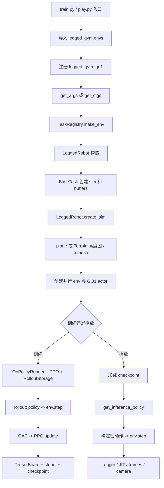
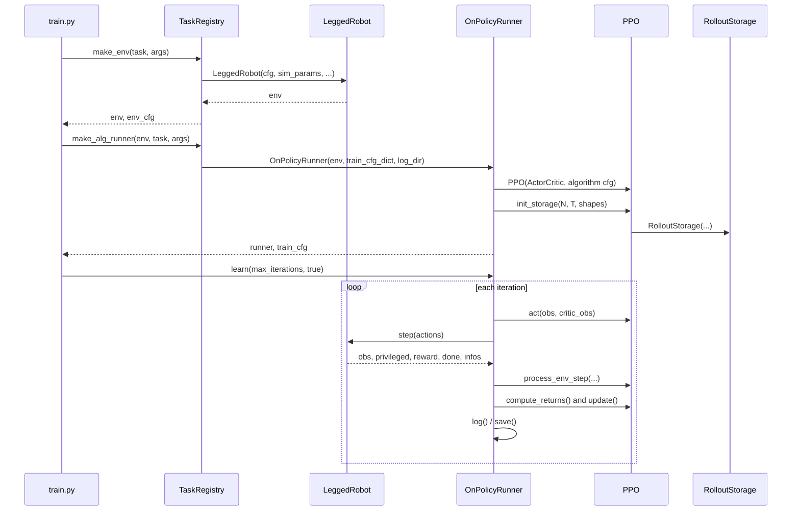
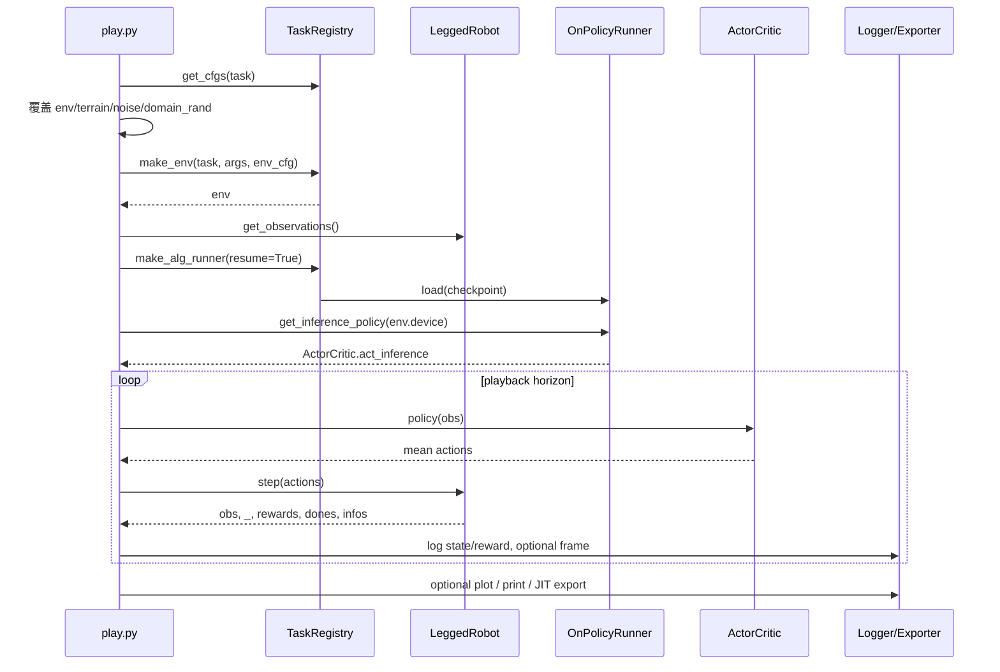
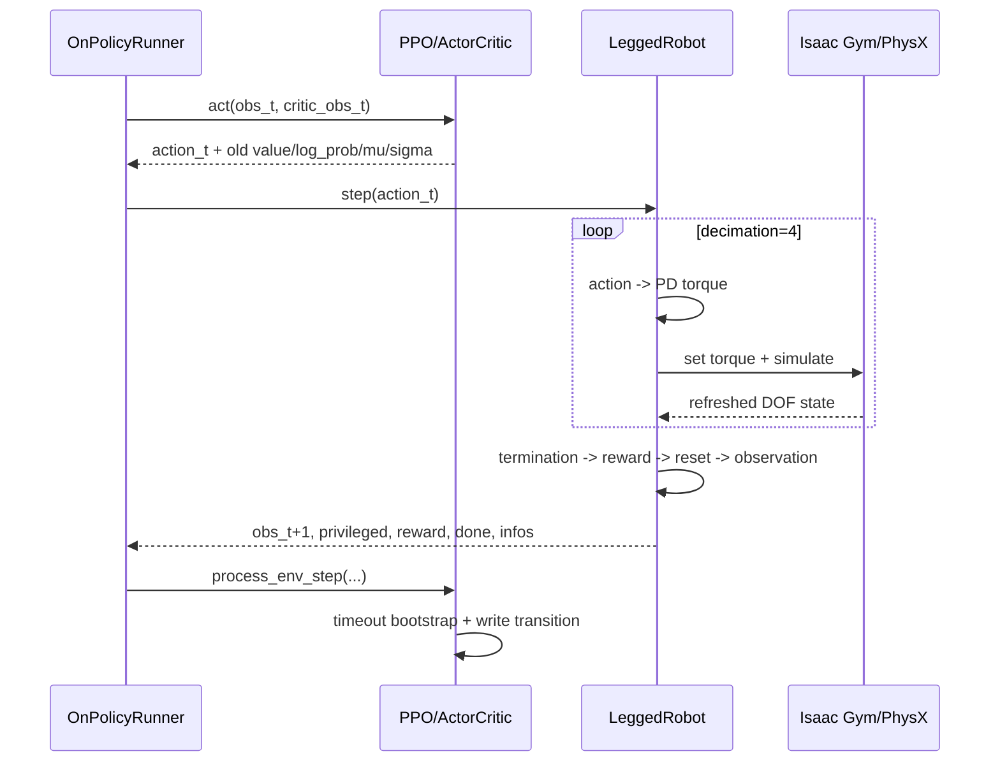
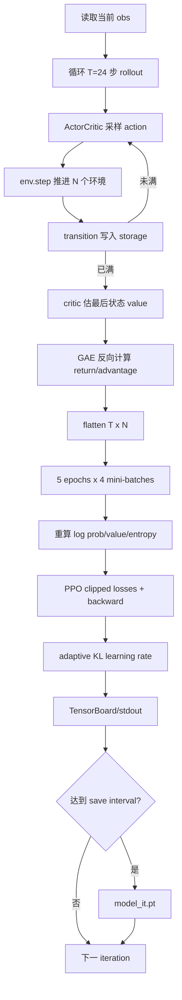

# 原生 legged_gym 全流程中文说明：GO1 + LeggedRobot + rsl_rl PPO

本文只覆盖本仓库当前的原生 `legged_gym` 子集：

- 环境：`legged_gym/envs/base/legged_robot.py` 的 `LeggedRobot`
- 环境配置：`legged_gym/envs/legged_gym_go1/legged_gym_go1_config.py` 的 `GO1RoughCfg`
- 训练配置：`legged_gym/envs/legged_gym_go1/legged_gym_go1_config.py` 的 `GO1RoughCfgPPO`
- 原生 PPO 栈：`rsl_rl/rsl_rl/runners/on_policy_runner.py` 的 `OnPolicyRunner`，`rsl_rl/rsl_rl/algorithms/ppo.py` 的 `PPO`，`rsl_rl/rsl_rl/storage/rollout_storage.py` 的 `RolloutStorage`，`rsl_rl/rsl_rl/modules/actor_critic.py` 的 `ActorCritic`

本文明确不展开 HIM、CTS、MGDP 的算法细节。只在“实际接入偏差”章节指出它们对当前原生链路造成的接口偏差，例如 `make_alg_runner()` 当前硬编码 `HIMOnPolicyRunner`。

## 0. 阅读边界、源码来源与使用方法

这份文档同时讨论三种“流程”，阅读时必须先区分它们：

| 标记 | 含义 | 是否存在于当前仓库 | 能否直接运行 |
| --- | --- | --- | --- |
| 当前仓库源码 | 工作区内可以直接打开的 Python 文件 | 是 | 单个模块存在，但训练入口不完整 |
| canonical 原生流程 | `LeggedRobot + OnPolicyRunner + PPO` 应有的标准接线 | 大部分存在 | 当前 `TaskRegistry` 接线下不能直接运行 |
| 官方上游入口 | `leggedrobotics/legged_gym` 的 `train.py`、`play.py` | 否 | 不能原样复制后直接运行 |

官方入口参考固定为：

- 仓库：`leggedrobotics/legged_gym`
- commit：`8fa29acc6fd1910c3d9659eef6310bdd301cde0a`
- `train.py`：<https://github.com/leggedrobotics/legged_gym/blob/8fa29acc6fd1910c3d9659eef6310bdd301cde0a/legged_gym/scripts/train.py>
- `play.py`：<https://github.com/leggedrobotics/legged_gym/blob/8fa29acc6fd1910c3d9659eef6310bdd301cde0a/legged_gym/scripts/play.py>

其中 `train.py`、`play.py` 的代码块只保留理解入口所需的短节选，完整行为通过等价伪代码、时序图和当前本地实现逐段展开。其余标为“当前仓库原文”的代码块均来自本工作区。

### 0.1 先看这一张总图



### 0.2 每个源码块怎样读

后文对关键源码统一回答五个问题：

1. **谁调用它**：上一级入口或对象是谁。
2. **它读取什么**：cfg、张量、CLI 参数或状态。
3. **它创建或修改什么**：对象、buffer、仿真状态或文件。
4. **它返回什么**：返回值的类型、形状和语义。
5. **下一位接收者是谁**：返回值会进入哪个函数或模块。

## 1. 端到端顺序

原生训练链路可以理解为一条从任务名到 PPO 更新的单向流水线：

1. 入口代码导入 `legged_gym.envs`，触发 `task_registry.register("legged_gym_go1", LeggedRobot, GO1RoughCfg, GO1RoughCfgPPO)`。
2. 入口代码解析 CLI 参数，通常来自 `legged_gym/utils/helpers.py` 的 `get_args()`。
3. `task_registry.make_env(name, args)` 根据任务名取出 `LeggedRobot` 和 `GO1RoughCfg`，合并 CLI 覆盖项，解析 Isaac Gym `SimParams`，实例化环境。
4. `LeggedRobot.__init__()` 调用 `_parse_cfg()`，再进入 `BaseTask.__init__()` 创建 gym、sim、terrain、env、viewer 和基础 buffer。
5. `BaseTask.__init__()` 调用 `LeggedRobot.create_sim()`，后者创建 Isaac Gym sim、地形和并行机器人 actor。
6. `LeggedRobot.__init__()` 返回 `BaseTask.__init__()` 后继续 `_init_buffers()` 和 `_prepare_reward_function()`，得到可训练的向量化环境。
7. 原生 canonical 路径应使用 `OnPolicyRunner(env, train_cfg_dict, log_dir, device)`。runner 从 `GO1RoughCfgPPO` 的 `runner`、`algorithm`、`policy` 三段配置创建 `ActorCritic`、`PPO` 和 `RolloutStorage`。
8. `OnPolicyRunner.learn()` 循环收集 rollout：`PPO.act()` 采样动作，`LeggedRobot.step(actions)` 推进仿真，`PPO.process_env_step()` 把单步 transition 写入 storage。
9. 每个 rollout 满 `num_steps_per_env` 后，`PPO.compute_returns()` 调用 `RolloutStorage.compute_returns()` 计算 GAE 和 return。
10. `PPO.update()` 读取 mini-batch，重算当前策略的 log probability、value、entropy，执行 PPO clipped surrogate/value loss 更新。
11. `OnPolicyRunner.log()` 写 TensorBoard 和控制台统计，`OnPolicyRunner.save()` 写 checkpoint，推理时 `get_inference_policy()` 返回 `ActorCritic.act_inference`。

## 2. 模块职责

| 模块 | 核心符号 | 职责 |
| --- | --- | --- |
| `legged_gym/envs/__init__.py` | `task_registry.register("legged_gym_go1", ...)` | 把任务名、环境类、环境配置、训练配置绑定起来。 |
| `legged_gym/utils/task_registry.py` | `TaskRegistry` | 管理注册表，创建环境，创建训练 runner，处理 log 路径和 resume。 |
| `legged_gym/utils/helpers.py` | `get_args()`、`update_cfg_from_args()`、`parse_sim_params()`、`class_to_dict()` | CLI 解析、配置覆盖、类配置转 dict、Isaac Gym `SimParams` 解析。 |
| `legged_gym/envs/base/base_config.py` | `BaseConfig` | 递归实例化嵌套配置类，使 `cfg.env.num_envs` 这类访问成为实例属性访问。 |
| `legged_gym/envs/base/legged_robot_config.py` | `LeggedRobotCfg`、`LeggedRobotCfgPPO` | 提供环境、地形、命令、控制、奖励、归一化、噪声、仿真和 PPO 默认配置。 |
| `legged_gym/envs/legged_gym_go1/legged_gym_go1_config.py` | `GO1RoughCfg`、`GO1RoughCfgPPO` | 覆盖 GO1 初始姿态、PD 控制、URDF、接触终止、部分奖励和实验名。 |
| `legged_gym/envs/base/base_task.py` | `BaseTask` | 持有 Isaac Gym 句柄，创建基础 obs/reward/reset buffer，调用子类 `create_sim()`，实现 viewer 渲染和全环境 reset。 |
| `legged_gym/envs/base/legged_robot.py` | `LeggedRobot` | 具体腿式机器人环境：创建地形和 actor，维护状态张量，执行 decimation，计算观测、奖励、reset。 |
| `legged_gym/utils/terrain.py` | `Terrain` | 生成 heightfield/trimesh 的高度图、子地形、env origins。 |
| `rsl_rl/rsl_rl/env/vec_env.py` | `VecEnv` | 定义 runner 对环境的最小接口约束。 |
| `rsl_rl/rsl_rl/runners/on_policy_runner.py` | `OnPolicyRunner` | 控制采样、更新、日志、保存、加载和推理 policy 导出入口。 |
| `rsl_rl/rsl_rl/algorithms/ppo.py` | `PPO` | 管理 actor-critic、optimizer、rollout storage，执行 PPO/GAE/update。 |
| `rsl_rl/rsl_rl/storage/rollout_storage.py` | `RolloutStorage` | 保存 rollout 张量，计算 return/advantage，生成 mini-batch。 |
| `rsl_rl/rsl_rl/modules/actor_critic.py` | `ActorCritic` | 构造 actor MLP、critic MLP、可学习高斯标准差和推理动作均值。 |

## 3. 配置递归与 CLI 覆盖

### 3.1 配置类不是 dataclass

`LeggedRobotCfg` 和 `LeggedRobotCfgPPO` 使用嵌套 class 表达配置，而不是 dataclass 或 YAML。`BaseConfig.__init__()` 提供了递归实例化能力：显式调用 `GO1RoughCfg()` 时，它会把嵌套 class 变成嵌套实例。

但当前仓库注册时传入的是 `GO1RoughCfg` 和 `GO1RoughCfgPPO` 类对象，没有括号。因此当前真实链路并未调用 `BaseConfig.__init__()`，而是直接通过类属性访问 `env_cfg.env.num_envs`、`train_cfg.runner.max_iterations`。`class_to_dict()` 同时支持 class 对象，所以 runner 前的字典转换仍可工作。

无论使用类对象还是实例，子类都会通过继承局部覆盖父类，例如 `GO1RoughCfg.control.decimation = 4` 覆盖 `LeggedRobotCfg.control.decimation`，未覆盖项继续来自父类。区别在于当前 CLI/play 覆盖修改的是全局类属性，而不是一个独立 cfg 实例。

### 3.2 GO1 环境配置

`GO1RoughCfg` 的关键覆盖位于 `legged_gym/envs/legged_gym_go1/legged_gym_go1_config.py`：

- `init_state.pos = [0.0, 0.0, 0.42]`，并为 12 个 GO1 关节定义 `default_joint_angles`。
- `control.control_type = "P"`，`stiffness = {"joint": 20.0}`，`damping = {"joint": 0.5}`，`action_scale = 0.25`，`decimation = 4`。
- `asset.file = "{LEGGED_GYM_ROOT_DIR}/resources/robots/go1/urdf/go1.urdf"`，`foot_name = "foot"`，`terminate_after_contacts_on = ["base"]`。
- `rewards.soft_dof_pos_limit = 0.9`，`base_height_target = 0.25`，并覆盖 `torques`、`dof_pos_limits` 两个 reward scale。

`LeggedRobotCfg` 中未被 GO1 覆盖的默认项仍然生效，例如：

- `env.num_envs = 4096`，`num_observations = 235`，`num_actions = 12`，`episode_length_s = 20`。
- `terrain.mesh_type = "plane"`，但 `measure_heights = True`。plane 情况下 `_get_heights()` 返回全零高度。
- `commands.num_commands = 4`，`heading_command = True`。
- `normalization.clip_observations = 100.0`，`clip_actions = 100.0`。
- `noise.add_noise = True`。
- `sim.dt = 0.005`，PhysX 默认 TGS solver。

### 3.3 GO1 PPO 配置

`GO1RoughCfgPPO` 继承 `LeggedRobotCfgPPO`，只覆盖：

- `algorithm.entropy_coef = 0.01`
- `runner.run_name = ""`
- `runner.experiment_name = "rough_a1"`

其余原生 PPO 默认项来自 `LeggedRobotCfgPPO`：

- `runner_class_name = "OnPolicyRunner"`
- `policy_class_name = "ActorCritic"`
- `algorithm_class_name = "PPO"`
- `num_steps_per_env = 24`
- `max_iterations = 1500`
- `save_interval = 50`
- policy MLP hidden dims 为 `[512, 256, 128]`
- PPO 默认 `clip_param = 0.2`，`gamma = 0.99`，`lam = 0.95`，`num_learning_epochs = 5`，`num_mini_batches = 4`，`schedule = "adaptive"`，`desired_kl = 0.01`

### 3.4 CLI 覆盖路径

`legged_gym/utils/helpers.py` 的 `get_args()` 注册以下和原生链路相关的参数：

- `--task`：默认值是 `"aliengo"`。
- `--resume`
- `--experiment_name`
- `--run_name`
- `--load_run`
- `--checkpoint`
- `--headless`
- `--rl_device`
- `--num_envs`
- `--seed`
- `--max_iterations`

`TaskRegistry.make_env()` 会调用 `update_cfg_from_args(env_cfg, None, args)`，只覆盖环境侧：

- `args.num_envs -> env_cfg.env.num_envs`
- `args.seed -> env_cfg.seed`

`TaskRegistry.make_alg_runner()` 会调用 `update_cfg_from_args(None, train_cfg, args)`，只覆盖训练侧：

- `args.seed -> train_cfg.seed`
- `args.max_iterations -> train_cfg.runner.max_iterations`
- `args.resume -> train_cfg.runner.resume`
- `args.experiment_name -> train_cfg.runner.experiment_name`
- `args.run_name -> train_cfg.runner.run_name`
- `args.load_run -> train_cfg.runner.load_run`
- `args.checkpoint -> train_cfg.runner.checkpoint`

`class_to_dict()` 在 runner 创建前把 cfg 类对象或实例递归转换为普通 dict，`OnPolicyRunner` 实际消费的是 `train_cfg["runner"]`、`train_cfg["algorithm"]`、`train_cfg["policy"]`。

## 4. 注册、任务选择与环境创建

### 4.1 注册

`legged_gym/envs/__init__.py` 只注册当前原生 GO1 任务：

```text
task_registry.register("legged_gym_go1", LeggedRobot, GO1RoughCfg, GO1RoughCfgPPO)
```

注册表内部保存三张 dict：

- `task_classes[name] -> task_class`
- `env_cfgs[name] -> env_cfg`
- `train_cfgs[name] -> train_cfg`

`TaskRegistry.get_cfgs(name)` 取出 env/train 配置，并把 `train_cfg.seed` 复制到 `env_cfg.seed`。

### 4.2 环境创建

`TaskRegistry.make_env(name, args, env_cfg)` 的实际顺序：

1. 若 `args is None`，调用 `get_args()`。
2. 检查 `name in self.task_classes`，否则抛 `ValueError("Task with name: ... was not registered")`。
3. 若没有传入 `env_cfg`，调用 `get_cfgs(name)`。
4. 用 CLI 覆盖 env cfg。
5. 调用 `set_seed(env_cfg.seed)` 设置 Python、NumPy、Torch、CUDA seed。
6. 用 `class_to_dict(env_cfg.sim)` 生成 sim 配置 dict。
7. 调用 `parse_sim_params(args, sim_params)` 得到 Isaac Gym `gymapi.SimParams`。
8. 实例化 `task_class(cfg=env_cfg, sim_params=sim_params, physics_engine=args.physics_engine, sim_device=args.sim_device, headless=args.headless)`。

这里的 `args.sim_device` 在 `get_args()` 末尾被设置为 `args.rl_device`。也就是说当前 helper 默认把仿真 device 对齐到 RL device。

## 5. Isaac Gym sim、地形生成与机器人摆放

### 5.1 BaseTask 初始化

`BaseTask.__init__()` 是所有环境的公共初始化层：

- `gymapi.acquire_gym()` 获取 Isaac Gym API 句柄。
- 根据 `sim_device` 和 `sim_params.use_gpu_pipeline` 决定环境张量 device。CUDA + GPU pipeline 时使用 sim device，否则使用 CPU。
- headless 时把 `graphics_device_id` 设为 `-1`。
- 从 cfg 读取 `num_envs`、`num_obs`、`num_privileged_obs`、`num_actions`。
- 分配 `obs_buf`、`rew_buf`、`reset_buf`、`episode_length_buf`、`time_out_buf`，必要时分配 `privileged_obs_buf`。
- 调用子类 `create_sim()`。
- 调用 `gym.prepare_sim(self.sim)`。
- 非 headless 时创建 viewer，并注册 `ESC` 和 `V` 键事件。

### 5.2 LeggedRobot 创建 sim

`LeggedRobot.create_sim()` 的顺序：

1. 设置 `up_axis_idx = 2`，即 z-up。
2. 调用 `gym.create_sim(...)`。
3. 读取 `cfg.terrain.mesh_type`。
4. 如果是 `heightfield` 或 `trimesh`，先创建 `Terrain(cfg.terrain, num_envs)`。
5. `plane` 调 `_create_ground_plane()`；`heightfield` 调 `_create_heightfield()`；`trimesh` 调 `_create_trimesh()`；其他非 None 值报错。
6. 调 `_create_envs()` 加载机器人资产并创建并行环境。

`GO1RoughCfg` 继承的默认 `terrain.mesh_type = "plane"`，所以当前 GO1 原生默认会走 `_create_ground_plane()`，不会生成 rough heightfield/trimesh。尽管类名是 `GO1RoughCfg`，实际默认 terrain 是 plane，除非用户显式改 cfg。

### 5.3 Terrain 生成

`Terrain.__init__()` 只在 `mesh_type` 为 `heightfield` 或 `trimesh` 时真正生成高度图：

- 根据 `terrain_length`、`terrain_width`、`horizontal_scale`、`border_size` 计算每个子地形像素尺寸和总高度图尺寸。
- `cfg.num_sub_terrains = cfg.num_rows * cfg.num_cols`。
- `env_origins` 形状为 `[num_rows, num_cols, 3]`。
- `cfg.curriculum=True` 时调用 `curiculum()`，按 row 作为 difficulty、col 作为 terrain type choice 生成子地形。
- `cfg.selected=True` 时调用 `selected_terrain()`。
- 否则调用 `randomized_terrain()`。
- `trimesh` 会调用 `terrain_utils.convert_heightfield_to_trimesh()` 生成 vertices 和 triangles。

`add_terrain_to_map()` 把每个 `SubTerrain.height_field_raw` 拷贝到总高度图，并计算该子地形中心附近平台最高点作为 `env_origin_z`。`LeggedRobot._get_env_origins()` 后续会把机器人放到这些 origin 上。

### 5.4 Ground plane、heightfield、trimesh

`_create_ground_plane()` 使用 `gymapi.PlaneParams()`，设置法向 `[0,0,1]`，并从 cfg 写入 static friction、dynamic friction、restitution。

`_create_heightfield()` 使用 `gymapi.HeightFieldParams()`，设置 row/column scale、vertical scale、总行列数、border 偏移和摩擦参数，然后 `gym.add_heightfield()`。同时把 `terrain.heightsamples` 变为 torch tensor 存到 `self.height_samples`。

`_create_trimesh()` 使用 `gymapi.TriangleMeshParams()`，设置 vertex/triangle 数、border 偏移和摩擦参数，然后 `gym.add_triangle_mesh()`。同样保存 `height_samples`，供高度观测使用。

### 5.5 加载 GO1 资产和创建 actor

`LeggedRobot._create_envs()` 负责加载 URDF/MJCF 并复制到所有 env：

1. `asset_path = cfg.asset.file.format(LEGGED_GYM_ROOT_DIR=LEGGED_GYM_ROOT_DIR)`。
2. 设置 `gymapi.AssetOptions()`，包括 drive mode、fixed joint collapse、capsule 替换、visual flip、base fix、density、damping、armature、gravity 等。
3. `gym.load_asset(self.sim, asset_root, asset_file, asset_options)` 加载 GO1。
4. 读取 DOF 数、刚体数、DOF properties、rigid shape properties、body names、dof names。
5. 通过 `cfg.asset.foot_name`、`penalize_contacts_on`、`terminate_after_contacts_on` 找 feet、惩罚接触刚体、终止接触刚体。
6. 把 `cfg.init_state` 拼成 `base_init_state`，建立 `start_pose`。
7. 调 `_get_env_origins()` 得到每个 env 的世界 origin。
8. 循环 `num_envs` 次创建 env，给 origin 加 xy 随机偏移，设置 friction 随机化，创建 actor，设置 DOF 和刚体属性。
9. 保存 `feet_indices`、`penalised_contact_indices`、`termination_contact_indices`。

`_get_env_origins()` 在 rough terrain 上使用 `Terrain.env_origins`，并维护 `terrain_levels`、`terrain_types`、`terrain_origins`。在 plane 或 none 上创建规则网格，间距来自 `cfg.env.env_spacing`。

## 6. BaseTask 与 VecEnv 接口契约

`rsl_rl/rsl_rl/env/vec_env.py` 的 `VecEnv` 是 runner 依赖的最小接口：

- 属性：`num_envs`、`num_obs`、`num_privileged_obs`、`num_actions`、`max_episode_length`、`privileged_obs_buf`、`obs_buf`、`rew_buf`、`reset_buf`、`episode_length_buf`、`extras`、`device`。
- 方法：`step(actions)`、`reset(...)`、`get_observations()`、`get_privileged_observations()`。
- `step()` 应返回五元组：`obs, privileged_obs, rewards, dones, infos`。

`BaseTask` 提供这些属性和 `get_observations()`、`get_privileged_observations()`，但 `step()` 和 `reset_idx()` 由子类实现。`BaseTask.reset()` 会 reset 全部 env，然后用全零动作调用一次 `step()`，返回 `obs, privileged_obs`。

注意一个细节：`VecEnv.reset()` 抽象签名写的是 `reset(self, env_ids)`，但 `BaseTask.reset()` 和 `OnPolicyRunner.__init__()` 实际使用的是无参数 `env.reset()`。当前原生代码按 `BaseTask.reset()` 运行。

## 7. LeggedRobot.step 的 decimation 与 post-physics 顺序

`LeggedRobot.step(actions)` 是环境每个 policy step 的核心：

1. 根据 `cfg.normalization.clip_actions` 裁剪输入动作，并移动到 env device。
2. 调用 `render()`。如果有 viewer，会处理窗口、键盘、graphics 和 frame sync。
3. 循环 `cfg.control.decimation` 次。GO1 默认 decimation=4。
4. 每个 sim 子步调用 `_compute_torques(self.actions)`。
5. 用 `gym.set_dof_actuation_force_tensor()` 写入力矩。
6. 调用 `gym.simulate(self.sim)`。
7. CPU pipeline 时调用 `gym.fetch_results(self.sim, True)`。
8. 每个子步后刷新 DOF state tensor。
9. decimation 循环结束后调用 `post_physics_step()`。
10. 裁剪 `obs_buf` 和 `privileged_obs_buf`。
11. 返回 `obs_buf, privileged_obs_buf, rew_buf, reset_buf, extras`。

`_compute_torques()` 支持三种控制语义：

- `"P"`：`p_gains * (action_scale * action + default_dof_pos - dof_pos) - d_gains * dof_vel`
- `"V"`：速度目标 PD
- `"T"`：动作直接作为缩放后的力矩

GO1 默认是 `"P"`。最终力矩会按 URDF torque limits 裁剪。

### 7.1 post_physics_step 的内部顺序

`post_physics_step()` 的顺序很重要：

1. 刷新 root state 和 net contact force tensor。
2. `episode_length_buf += 1`，`common_step_counter += 1`。
3. 更新 `base_quat`、base frame 下的线速度、角速度、投影重力。
4. 调 `_post_physics_step_callback()`。
5. 调 `check_termination()`。
6. 调 `compute_reward()`。
7. 取 `env_ids = reset_buf.nonzero(...).flatten()`。
8. 调 `reset_idx(env_ids)`。
9. 调 `compute_observations()`。
10. 更新 `last_actions`、`last_dof_vel`、`last_root_vel`。
11. 如启用 debug viewer，绘制高度采样点。

这意味着 reward 是在 reset 前、基于本步物理结果计算的；observation 是在 reset 后计算的，所以已经终止的 env 返回的是 reset 后的新初始观测。这也是 PPO 中 timeout bootstrap 和 done 处理存在的原因。

### 7.2 post-physics callback

`_post_physics_step_callback()` 做三类环境公共更新：

- 按 `commands.resampling_time / dt` 重新采样 command。
- 若 `heading_command=True`，根据当前 yaw 和目标 heading 更新 `commands[:, 2]` 的 yaw rate。
- 若 `terrain.measure_heights=True`，调用 `_get_heights()` 更新高度观测。
- 若 `domain_rand.push_robots=True` 且到达 push interval，调用 `_push_robots()` 随机改 base xy 速度。

`_parse_cfg()` 中的 `self.dt = control.decimation * sim_params.dt`，GO1 默认为 `4 * 0.005 = 0.02s`，即 policy step 频率约 50 Hz。

## 8. 观测、奖励与 reset

### 8.1 buffer 初始化

`LeggedRobot._init_buffers()` 从 Isaac Gym 获取并包装底层张量：

- `root_states = gymtorch.wrap_tensor(actor_root_state)`
- `dof_state = gymtorch.wrap_tensor(dof_state_tensor)`
- `dof_pos = dof_state.view(num_envs, num_dof, 2)[..., 0]`
- `dof_vel = dof_state.view(num_envs, num_dof, 2)[..., 1]`
- `contact_forces = net_contact_forces.view(num_envs, -1, 3)`
- `base_quat = root_states[:, 3:7]`

它还初始化动作、力矩、PD gains、命令、feet air time、上一帧动作/速度、重力向量、高度采样点和默认关节角。

PD gain 匹配方式是字符串包含：遍历每个 DOF name，若 cfg 中某个 stiffness key 是 DOF name 的子串，就使用该 stiffness/damping。GO1 使用 key `"joint"`，可以匹配所有 `*_joint`。

### 8.2 观测布局

`compute_observations()` 拼接以下向量：

1. base frame 线速度，3 维，乘 `obs_scales.lin_vel`
2. base frame 角速度，3 维，乘 `obs_scales.ang_vel`
3. projected gravity，3 维
4. commands 前 3 维，乘 `commands_scale`
5. `(dof_pos - default_dof_pos)`，12 维，乘 `obs_scales.dof_pos`
6. `dof_vel`，12 维，乘 `obs_scales.dof_vel`
7. 当前 actions，12 维
8. 若 `terrain.measure_heights=True`，追加高度测量，默认 17 * 11 = 187 维

总维度为 `3+3+3+3+12+12+12+187 = 235`，对应 `LeggedRobotCfg.env.num_observations = 235`。

高度项为 `root_z - 0.5 - measured_heights`，裁剪到 `[-1, 1]` 后乘 `obs_scales.height_measurements`。plane 模式下 `_get_heights()` 返回零高度。

若 `noise.add_noise=True`，`obs_buf` 会加上 `[-1,1]` 均匀噪声乘 `_get_noise_scale_vec()`。noise scale 各段必须和观测 layout 保持一致。

### 8.3 reward 函数准备

`_prepare_reward_function()` 会把 `cfg.rewards.scales` 转成 dict，然后：

- 删除 scale 为 0 的 reward 项。
- 对非零 scale 乘以 `self.dt`，把每秒奖励权重转成每 policy step 权重。
- 对每个非 termination reward，查找同名方法 `_reward_<name>` 并加入 `reward_functions`。
- 为每个 reward 项创建 `episode_sums[name]`。

如果配置里打开了某个非零 reward scale，但 `LeggedRobot` 没有对应 `_reward_xxx()`，初始化阶段会因 `getattr(self, name)` 报错。

### 8.4 reward 计算

`compute_reward()` 每步清空 `rew_buf`，遍历所有 reward function：

- `rew = reward_fn() * reward_scales[name]`
- 累加到 `rew_buf`
- 累加到 `episode_sums[name]`

若 `only_positive_rewards=True`，总 reward 会裁剪到非负。随后如果 `termination` scale 存在，再追加 termination reward。当前默认 `termination = -0.0`，会在 prepare 阶段被删除。

原生 `LeggedRobot` 中可用 reward 包括：

- `lin_vel_z`
- `ang_vel_xy`
- `orientation`
- `base_height`
- `torques`
- `dof_vel`
- `dof_acc`
- `action_rate`
- `collision`
- `termination`
- `dof_pos_limits`
- `dof_vel_limits`
- `torque_limits`
- `tracking_lin_vel`
- `tracking_ang_vel`
- `feet_air_time`
- `stumble`
- `stand_still`
- `feet_contact_forces`

GO1 默认在父类基础上把 `torques` 改成 `-0.0002`，把 `dof_pos_limits` 改成 `-10.0`。

### 8.5 termination 与 reset

`check_termination()` 设置：

- `reset_buf = any(norm(contact_forces[:, termination_contact_indices, :]) > 1.0)`
- `time_out_buf = episode_length_buf > max_episode_length`
- `reset_buf |= time_out_buf`

GO1 的 `terminate_after_contacts_on = ["base"]`，因此 base 接触会触发 done。

`reset_idx(env_ids)` 的顺序：

1. 若 rough terrain curriculum 开启，更新 terrain level。
2. 若 command curriculum 开启且到 episode 边界，更新 command range。
3. `_reset_dofs(env_ids)`：关节位置随机为 `0.5x~1.5x default_dof_pos`，速度置零。
4. `_reset_root_states(env_ids)`：base 回到 init state + env origin，速度随机到 `[-0.5,0.5]`。
5. `_resample_commands(env_ids)`。
6. 清空 last actions、last dof vel、feet air time、episode length。
7. `reset_buf[env_ids] = 1`。
8. 写 `extras["episode"]`，包含各 reward 的 episode 平均值。
9. 若 `send_timeouts=True`，写 `extras["time_outs"] = time_out_buf`。

`extras["time_outs"]` 会被 PPO 用于 timeout bootstrap。

## 9. 原生 rsl_rl 配置消费与 runner setup

### 9.1 OnPolicyRunner 初始化

`OnPolicyRunner.__init__(env, train_cfg, log_dir, device)` 假设 `train_cfg` 已经是 dict。它读取：

- `self.cfg = train_cfg["runner"]`
- `self.alg_cfg = train_cfg["algorithm"]`
- `self.policy_cfg = train_cfg["policy"]`

critic 输入维度由 env 决定：

- 若 `env.num_privileged_obs is not None`，critic obs 维度为 privileged obs。
- 否则 critic obs 维度等于 actor obs 维度。

然后：

1. `actor_critic_class = eval(self.cfg["policy_class_name"])`，默认 `ActorCritic`。
2. 创建 `ActorCritic(env.num_obs, num_critic_obs, env.num_actions, **policy_cfg)`。
3. `alg_class = eval(self.cfg["algorithm_class_name"])`，默认 `PPO`。
4. 创建 `PPO(actor_critic, device=device, **alg_cfg)`。
5. 读取 `num_steps_per_env` 和 `save_interval`。
6. `alg.init_storage(env.num_envs, num_steps_per_env, [env.num_obs], [env.num_privileged_obs], [env.num_actions])`。
7. 初始化日志状态和当前 iteration。
8. 调用 `env.reset()`。

### 9.2 ActorCritic

`ActorCritic` 是非 recurrent MLP：

- actor 输入 `num_actor_obs`，输出 `num_actions` 维均值。
- critic 输入 `num_critic_obs`，输出 1 维 value。
- actor 和 critic hidden dims 分开配置，默认均为 `[512, 256, 128]`。
- 激活函数由 `get_activation()` 解析，默认 `elu`。
- `self.std` 是 `nn.Parameter(init_noise_std * ones(num_actions))`。
- `update_distribution(observations)` 构造 `Normal(mean, mean*0. + self.std)`。
- `act()` 从分布采样动作。
- `get_actions_log_prob()` 对动作维 log prob 求和。
- `act_inference()` 只返回 actor 均值，用于部署。

### 9.3 PPO 初始化

`PPO.__init__()` 保存超参数，持有 `actor_critic`，创建 `optim.Adam(self.actor_critic.parameters(), lr=learning_rate)`，并创建一个临时 `RolloutStorage.Transition()`。storage 在 runner 调 `init_storage()` 时才真正分配。

关键超参数来自 `LeggedRobotCfgPPO.algorithm`：

- `num_learning_epochs`
- `num_mini_batches`
- `clip_param`
- `gamma`
- `lam`
- `value_loss_coef`
- `entropy_coef`
- `learning_rate`
- `max_grad_norm`
- `use_clipped_value_loss`
- `schedule`
- `desired_kl`

## 10. Rollout、GAE 与 PPO update

### 10.1 rollout 单步

在 `OnPolicyRunner.learn()` 中，每个 iteration 包含 `num_steps_per_env` 个环境 step。每个 step：

1. `actions = alg.act(obs, critic_obs)`。
2. `PPO.act()` 内部调用 actor 采样动作，critic 估 value，并保存 action log prob、action mean、action sigma、obs、critic obs 到 `transition`。
3. `env.step(actions)` 返回新 obs、privileged obs、rewards、dones、infos。
4. runner 更新 `critic_obs = privileged_obs if privileged_obs is not None else obs`。
5. `alg.process_env_step(rewards, dones, infos)`。
6. `PPO.process_env_step()` 复制 reward/done。若 `infos` 有 `time_outs`，把 `gamma * value * time_out` 加到 reward 上。
7. `storage.add_transitions(transition)` 把 transition 拷入 rollout buffer。
8. `transition.clear()`。
9. `actor_critic.reset(dones)`。原生 `ActorCritic.reset()` 是空实现，recurrent 模型才需要清 hidden state。

rollout 采样被包在 `torch.inference_mode()` 中，且 `PPO.act()` 对保存的动作、value、log prob、均值和标准差都做 `.detach()`。storage 保存的是旧策略统计量，不跨 rollout 保留计算图。

### 10.2 RolloutStorage 张量布局

`RolloutStorage` 的主要张量形状：

- `observations`: `[T, N, obs_dim]`
- `privileged_observations`: `[T, N, privileged_obs_dim]` 或 None
- `actions`: `[T, N, action_dim]`
- `rewards`: `[T, N, 1]`
- `dones`: `[T, N, 1]`
- `values`: `[T, N, 1]`
- `returns`: `[T, N, 1]`
- `advantages`: `[T, N, 1]`
- `actions_log_prob`: `[T, N, 1]`
- `mu`: `[T, N, action_dim]`
- `sigma`: `[T, N, action_dim]`

其中 `T = num_steps_per_env`，`N = env.num_envs`。普通 feed-forward generator 会把 `[T,N]` flatten 成 batch 维，再随机切成 `num_mini_batches` 个 mini-batch。

### 10.3 GAE 和 return

rollout 满后，runner 调：

```text
PPO.compute_returns(last_critic_obs)
```

`PPO.compute_returns()` 先用当前 critic 计算最后一个状态的 `last_values`，再调 `RolloutStorage.compute_returns(last_values, gamma, lam)`。

`RolloutStorage.compute_returns()` 从最后一个 step 倒序：

```text
delta = reward_t + (1 - done_t) * gamma * next_value - value_t
advantage = delta + (1 - done_t) * gamma * lam * advantage
return_t = advantage + value_t
```

最后：

```text
advantages = returns - values
advantages = (advantages - mean) / (std + 1e-8)
```

`done` 会切断跨 episode bootstrap；`infos["time_outs"]` 造成的 timeout bootstrap 已经在 `process_env_step()` 阶段加进 reward。

### 10.4 PPO update

`PPO.update()` 的顺序：

1. 根据 `actor_critic.is_recurrent` 选择普通或 recurrent mini-batch generator。GO1 原生 `ActorCritic.is_recurrent = False`，走普通 flatten mini-batch。
2. 对每个 batch，用当前 actor 对 `obs_batch` 重建分布。
3. 用当前分布计算 `actions_batch` 的新 log prob、mean、std、entropy。
4. 用当前 critic 对 `critic_obs_batch` 计算新 value。
5. 若 `schedule == "adaptive"` 且 `desired_kl` 不为 None，计算新旧对角高斯 KL。KL 过大则 learning rate 除以 1.5，过小则乘以 1.5，并写回 optimizer param group。
6. 计算 ratio：`exp(new_log_prob - old_log_prob)`。
7. 计算 PPO clipped surrogate loss。
8. 计算 value loss。若 `use_clipped_value_loss=True`，用旧 value 限制新 value 偏移。
9. 总 loss 为 `surrogate_loss + value_loss_coef * value_loss - entropy_coef * entropy`。
10. `optimizer.zero_grad()`，`loss.backward()`，`clip_grad_norm_()`，`optimizer.step()`。
11. 累积 mean value loss 和 mean surrogate loss。
12. 所有 epoch/batch 完成后 `storage.clear()`，返回均值 loss。

## 11. 日志、checkpoint 与导出

### 11.1 日志

`OnPolicyRunner.learn()` 中如果 `log_dir is not None`，首次进入会创建 `SummaryWriter(log_dir=log_dir, flush_secs=10)`。

`OnPolicyRunner.log()` 写入：

- `Episode/<key>`：来自 `infos["episode"]` 的各 episode 指标。
- `Loss/value_function`
- `Loss/surrogate`
- `Loss/learning_rate`
- `Policy/mean_noise_std`
- `Perf/total_fps`
- `Perf/collection time`
- `Perf/learning_time`
- `Train/mean_reward`
- `Train/mean_episode_length`
- 按 total time 记录的 mean reward 和 mean episode length。

控制台会打印 collection/learning 时间、fps、value loss、surrogate loss、mean action noise std、mean reward、mean episode length、总步数、总时间和 ETA。

### 11.2 checkpoint

`OnPolicyRunner.save(path)` 写：

```text
{
  "model_state_dict": actor_critic.state_dict(),
  "optimizer_state_dict": optimizer.state_dict(),
  "iter": current_learning_iteration,
  "infos": infos
}
```

`load(path, load_optimizer=True)` 恢复 actor-critic，必要时恢复 optimizer，并设置 `current_learning_iteration`。

`TaskRegistry.make_alg_runner()` 中的 resume 当前使用传入的 `train_path` 作为 `resume_path`，注释掉了原本的 `get_load_path(log_root, load_run, checkpoint)` 路径解析。

### 11.3 推理和导出

`OnPolicyRunner.get_inference_policy(device=None)`：

- 调 `actor_critic.eval()`。
- 必要时迁移到指定 device。
- 返回 `actor_critic.act_inference`。

`legged_gym/utils/helpers.py` 中也有 `export_policy_as_jit(actor_critic, path)`：对于没有 `estimator` 的原生 PPO，会深拷贝 `actor_critic.actor` 到 CPU，`torch.jit.script(model)` 后保存为 `policy_1.pt`。

`legged_gym/utils/exporter.py` 还提供更通用的 JIT/ONNX/PKL 导出工具。对于原生 PPO，`_TorchPolicyExporter.forward()` 等价于 `actor(normalizer(x))`；ONNX 的 `forward_ppo()` 会将堆叠观测按 term 还原后取最后一帧送入 actor。使用哪一个导出函数要以实际部署输入 layout 为准。

## 12. 官方 train.py：训练入口源码伴读

### 12.1 train.py 自己不实现算法

官方 `train.py` 很薄。它不创建神经网络层、不计算 reward，也不实现 PPO；它只负责把 CLI、注册表、环境和 runner 串起来。固定 commit 中的 `train()` 主体原文节选如下：

```python
def train(args):
    env, env_cfg = task_registry.make_env(name=args.task, args=args)
    ppo_runner, train_cfg = task_registry.make_alg_runner(
        env=env, name=args.task, args=args)
    ppo_runner.learn(
        num_learning_iterations=train_cfg.runner.max_iterations,
        init_at_random_ep_len=True)
```

逐句接收关系：

| 原文动作 | 读取 | 创建/返回 | 下一位接收者 |
| --- | --- | --- | --- |
| `make_env(...)` | task、CLI、env cfg | env、覆盖后的 env cfg | runner 创建 |
| `make_alg_runner(...)` | env、task、train cfg | runner、覆盖后的 train cfg | `learn()` |
| `runner.learn(...)` | max iterations、env 当前状态 | rollout、更新、日志、checkpoint | 训练结束 |

其余入口可用以下等价伪代码完整表达。注意这段是为了说明对象关系而重写的伪代码，不是假装当前仓库存在该文件：

```python
# 等价流程，不是当前仓库文件
import Isaac_Gym_first
import legged_gym.envs       # 导入时执行任务注册

args = parse_cli()
env, env_cfg = registry.create_environment(args.task, args)
runner, train_cfg = registry.create_native_runner(env, args.task, args)
runner.learn(
    iterations=train_cfg.runner.max_iterations,
    randomize_initial_episode_progress=True,
)
```

入口对象生命周期：

| 阶段 | 输入 | 创建/取得 | 返回给谁 |
| --- | --- | --- | --- |
| CLI | shell 参数 | `args` | `make_env()`、`make_alg_runner()` |
| env 创建 | task、env cfg、sim 参数 | `LeggedRobot` | runner |
| runner 创建 | env、train cfg dict、log dir | `ActorCritic`、`PPO`、storage | `train()` |
| learn | env 当前 obs、迭代数 | rollout、梯度更新、日志、checkpoint | 训练结束 |

### 12.2 为什么必须导入 legged_gym.envs

导入 `legged_gym.envs` 会执行当前仓库中的注册语句。当前仓库原文：`legged_gym/envs/__init__.py`

```python
from .base.legged_robot import LeggedRobot
from .legged_gym_go1.legged_gym_go1_config import (
    GO1RoughCfg, GO1RoughCfgPPO
)
from legged_gym.utils.task_registry import task_registry

task_registry.register(
    "legged_gym_go1", LeggedRobot, GO1RoughCfg, GO1RoughCfgPPO
)
```

- **调用者**：Python import 系统。
- **读取**：任务名、env class、env cfg class、train cfg class。
- **创建/修改**：修改全局 registry 的三张映射表。
- **返回**：import 不返回业务对象。
- **下一位接收者**：`make_env()`、`get_cfgs()` 按任务名查表。

入口若没有导入这个包，类文件即使存在也没有注册，`make_env()` 会报 task 未注册。

### 12.3 CLI 到 cfg 的覆盖关系

当前仓库原文：`legged_gym/utils/helpers.py`

```python
custom_parameters = [
    {"name": "--task", "type": str, "default": "aliengo"},
    {"name": "--resume", "action": "store_true", "default": False},
    {"name": "--rl_device", "type": str, "default": "cuda:0"},
    {"name": "--num_envs", "type": int},
    {"name": "--seed", "type": int},
    {"name": "--max_iterations", "type": int},
]
args = gymutil.parse_arguments(custom_parameters=custom_parameters)
args.sim_device = args.rl_device
```

| CLI 参数 | 被谁读取 | 最终去向 | 生效时间 |
| --- | --- | --- | --- |
| `--task` | train/play | registry key | 创建 cfg/env 前 |
| `--num_envs` | `update_cfg_from_args()` | `env_cfg.env.num_envs` | 分配 buffers 前 |
| `--seed` | env/train 两侧 | `env_cfg.seed`、`train_cfg.seed` | env/训练前 |
| `--max_iterations` | train cfg 覆盖 | `runner.max_iterations` | `learn()` 前 |
| `--resume` | train cfg 覆盖 | `runner.resume` | runner 创建后加载 |
| `--load_run` | train cfg 覆盖 | `runner.load_run` | canonical resume 选目录 |
| `--checkpoint` | train cfg 覆盖 | `runner.checkpoint` | canonical resume 选文件 |
| `--headless` | `make_env()` | `BaseTask.headless` | viewer 创建前 |
| `--rl_device` | helper/runner | RL device，同时赋给 sim device | env/runner 创建前 |

当前默认 `--task aliengo` 与唯一注册名 `legged_gym_go1` 不一致。因此这里解释的是参数流，不是在承诺不带参数的官方命令可直接用于本仓库。

### 12.4 make_env 原文与接收关系

当前仓库原文：`legged_gym/utils/task_registry.py`

```python
if name in self.task_classes:
    task_class = self.get_task_class(name)
else:
    raise ValueError(f"Task with name: {name} was not registered")
if env_cfg is None:
    env_cfg, _ = self.get_cfgs(name)
env_cfg, _ = update_cfg_from_args(env_cfg, None, args)
set_seed(env_cfg.seed)
sim_params = {"sim": class_to_dict(env_cfg.sim)}
sim_params = parse_sim_params(args, sim_params)
env = task_class(cfg=env_cfg, sim_params=sim_params,
                 physics_engine=args.physics_engine,
                 sim_device=args.sim_device,
                 headless=args.headless)
return env, env_cfg
```

- **调用者**：官方 `train(args)` 或 `play(args)`。
- **读取**：注册表、env cfg、CLI、Isaac Gym 通用参数。
- **创建/修改**：设置随机种子，创建 `SimParams`，实例化 `LeggedRobot`。
- **返回**：`env` 与覆盖后的 `env_cfg`。
- **下一位接收者**：训练时 env 进入 runner；play 时 env 先提供 obs，再进入 runner。

`task_class(...)` 不是轻量构造。它同步创建 sim、地形、并行 env、机器人 actor 和 Torch buffers，因此 `make_env()` 是启动过程最重的对象创建边界。

### 12.5 canonical runner 与当前本地断点

官方 canonical `TaskRegistry` 会直接实例化 `OnPolicyRunner`，并按 `load_run/checkpoint` 解析 resume path。当前 train cfg 顶层也声明了 `runner_class_name = "OnPolicyRunner"`，但官方原版 registry 本身并不依赖动态 `eval` 这个字段；真正重要的是创建出的 runner 类型必须与五元组原生 env 匹配。

当前仓库实际原文却是：

```python
train_cfg_dict = class_to_dict(train_cfg)
runner = HIMOnPolicyRunner(env, train_cfg_dict, log_dir,
                           device=args.rl_device)
resume = train_cfg.runner.resume
if resume:
    resume_path = train_path
    runner.load(resume_path)
return runner, train_cfg
```

这正是当前原生训练入口的断点：

- cfg 表达的是原生 `OnPolicyRunner` 意图，实现却直接硬编码成 HIM runner。
- 官方 `train.py` 不传 `train_path`，本地 resume 却把它作为唯一路径。
- HIM runner 期待原生 env 没有的字段和七元组 step 返回值。

因此官方 `train.py` 可作为原生架构说明，但不能在当前 `TaskRegistry` 未修正时直接使用。

### 12.6 init_at_random_ep_len 的真实作用

当前原生 runner 原文：`rsl_rl/rsl_rl/runners/on_policy_runner.py`

```python
if init_at_random_ep_len:
    self.env.episode_length_buf = torch.randint_like(
        self.env.episode_length_buf,
        high=int(self.env.max_episode_length),
    )
obs = self.env.get_observations()
privileged_obs = self.env.get_privileged_observations()
critic_obs = privileged_obs if privileged_obs is not None else obs
```

它不是随机改变 episode 的最大长度，而是把每个并行环境的“当前进度”随机分散到 `[0, max_episode_length)`：

- 避免 4096 个 env 在训练开始后同时 timeout。
- 让 reset、episode log 和 curriculum 更新尽早分散。
- GO1 当前没有 privileged obs，所以 critic obs 回退为 235 维 obs。

### 12.7 训练入口时序图



### 12.8 main guard：进程真正从哪里开始

官方 `train.py` 文件末尾原文节选：

```python
if __name__ == '__main__':
    args = get_args()
    train(args)
```

直接执行脚本时，Python 先完成顶部 import；导入 `legged_gym.envs` 的副作用已经完成任务注册。之后 main guard 才解析 CLI 并进入 `train(args)`。如果别的模块只 import `train.py`，guard 内代码不会自动训练，这使 `train(args)` 可以被其他入口复用。

## 13. 官方 play.py：加载、推理、记录与导出

### 13.1 play 与 train 的根本区别

`play.py` 仍要创建完整 env 和 runner，但不会调用 `learn()`：

- env 数量和 terrain grid 被压小，便于 viewer 观察。
- noise、friction randomization、push 通常关闭。
- `runner.resume=True`，从 checkpoint 恢复参数。
- 使用 `act_inference()` 返回 actor 均值，而不是从高斯分布采样。
- 循环旁路可记录状态、reward、帧和 camera，并导出 JIT。

官方脚本先取得 cfg 并在 env 构造前覆盖播放参数。固定 commit 原文节选：

```python
env_cfg, train_cfg = task_registry.get_cfgs(name=args.task)
env_cfg.env.num_envs = min(env_cfg.env.num_envs, 50)
env_cfg.terrain.num_rows = 5
env_cfg.terrain.num_cols = 5
env_cfg.terrain.curriculum = False
env_cfg.noise.add_noise = False
env_cfg.domain_rand.randomize_friction = False
env_cfg.domain_rand.push_robots = False
```

随后创建 env、加载 runner 并取得 policy callable。原文节选：

```python
env, _ = task_registry.make_env(
    name=args.task, args=args, env_cfg=env_cfg)
obs = env.get_observations()
train_cfg.runner.resume = True
ppo_runner, train_cfg = task_registry.make_alg_runner(
    env=env, name=args.task, args=args, train_cfg=train_cfg)
policy = ppo_runner.get_inference_policy(device=env.device)
```

它返回一个绑定方法，不是新模型副本。当前 `get_inference_policy()` 会将原模型切到 eval mode，再返回 `actor_critic.act_inference`。

播放主循环原文节选：

```python
for i in range(10 * int(env.max_episode_length)):
    actions = policy(obs.detach())
    obs, _, rews, dones, infos = env.step(actions.detach())
```

这三行形成闭环：旧 obs 进入 policy，均值 action 进入 env，env 返回的新 obs 覆盖旧变量，下一帧继续。`rews/dones/infos` 不参与动作计算，但被 Logger、episode reward 统计和终止分析旁路消费。

### 13.2 play 的完整等价伪代码

```python
# 等价流程，不是当前仓库文件
env_cfg, train_cfg = registry.get_cfgs(task)
limit_parallel_envs(env_cfg, at_most=50)
shrink_terrain_grid(env_cfg)
disable_curriculum_noise_friction_and_push(env_cfg)

env, _ = registry.make_env(task, args, env_cfg=env_cfg)
obs = env.get_observations()

train_cfg.runner.resume = True
runner, _ = registry.make_native_runner(env, task, args, train_cfg)
policy = runner.get_inference_policy(device=env.device)

optionally_export_actor_to_jit(runner)
for frame_index in playback_horizon:
    actions = policy(obs)
    obs, _, rewards, dones, infos = env.step(actions)
    optionally_record_state_reward_frame_and_camera()
```

### 13.3 play 临时 cfg 覆盖表

| 覆盖项 | 典型值/动作 | 原因 | 后续接收者 |
| --- | --- | --- | --- |
| `env.num_envs` | 最多 50 | 降低 viewer/记录开销 | `BaseTask` buffer 分配 |
| `terrain.num_rows` | 约 5 | 缩小 terrain map | `Terrain` |
| `terrain.num_cols` | 约 5 | 缩小 terrain type 网格 | `Terrain` |
| `terrain.curriculum` | `False` | 固定播放地形分布 | `Terrain.__init__()` |
| `noise.add_noise` | `False` | 观察确定性 policy | `compute_observations()` |
| `domain_rand.randomize_friction` | `False` | 固定接触条件 | `_create_envs()` |
| `domain_rand.push_robots` | `False` | 避免随机推力 | post-physics callback |
| `runner.resume` | `True` | 加载已训练参数 | `make_alg_runner()` |

这些覆盖必须发生在 `make_env()` 前，因为 buffers、terrain 和 randomization 参数在构造期已被消费，之后改 cfg 不会反向重建对象。

### 13.4 checkpoint 如何变成 policy callable

当前原生 runner 原文：

```python
def load(self, path, load_optimizer=True):
    loaded_dict = torch.load(path)
    self.alg.actor_critic.load_state_dict(
        loaded_dict['model_state_dict'])
    if load_optimizer:
        self.alg.optimizer.load_state_dict(
            loaded_dict['optimizer_state_dict'])
    self.current_learning_iteration = loaded_dict['iter']
    return loaded_dict['infos']

def get_inference_policy(self, device=None):
    self.alg.actor_critic.eval()
    if device is not None:
        self.alg.actor_critic.to(device)
    return self.alg.actor_critic.act_inference
```

接收链：

```text
model_<it>.pt
  -> torch.load
  -> actor_critic.load_state_dict
  -> get_inference_policy
  -> act_inference(obs)
  -> actor(obs) 的均值动作
```

播放通常不需要 optimizer，但当前 `load()` 默认会加载它。标准 runner 自己保存的 checkpoint 同时包含 model 和 optimizer，因此匹配；若外部 checkpoint 只有模型权重，需要显式改变加载行为。

### 13.5 为什么训练与播放动作不同

当前仓库原文：`rsl_rl/rsl_rl/modules/actor_critic.py`

```python
def act(self, observations, **kwargs):
    self.update_distribution(observations)
    return self.distribution.sample()

def act_inference(self, observations):
    actions_mean = self.actor(observations)
    return actions_mean
```

- 训练从 `Normal(mean, std)` 采样以探索。
- 播放直接返回 mean，对相同 obs 给出确定动作。
- 两者形状均为 `[num_envs, 12]`，env 不需要知道来源。

### 13.6 Logger 的接收关系

当前仓库原文：`legged_gym/utils/logger.py`

```python
def log_state(self, key, value):
    self.state_log[key].append(value)

def log_rewards(self, dict, num_episodes):
    for key, value in dict.items():
        if 'rew' in key:
            self.rew_log[key].append(value.item() * num_episodes)
    self.num_episodes += num_episodes
```

`Logger` 不会自己从 env 拉数据。play 循环必须显式传入 command、base velocity、关节状态/目标/torque、contact force，以及 `infos['episode']` 中由 reset 生成的 reward 汇总。

- `plot_states()`：启动 matplotlib 子进程画状态图。
- `print_rewards()`：按 episode 数归一后打印平均 reward。
- `reset()`：清空内存记录。

它和 TensorBoard 是两套通道：TensorBoard 属于训练 runner，`Logger` 主要属于 play 的观察与调试。

### 13.7 JIT、录帧和相机

当前仓库原生 JIT 导出分支：`legged_gym/utils/helpers.py`

```python
os.makedirs(path, exist_ok=True)
path = os.path.join(path, 'policy_1.pt')
model = copy.deepcopy(actor_critic.actor).to('cpu')
traced_script_module = torch.jit.script(model)
traced_script_module.save(path)
```

- 输入是 runner 内已经加载权重的 actor-critic。
- 原生分支只导出 actor MLP，不含 optimizer、critic 和 rollout state。
- 模型先复制到 CPU，再保存为 `policy_1.pt`。
- 部署端仍必须构造与训练完全一致的 235 维 observation。

官方 play 的录帧逻辑从 viewer camera sensor 取图后写入 `exported/frames`；相机移动则每步更新 camera position。二者是播放循环旁路，不改变 policy/env 五元组接口。

### 13.8 play 时序图



### 13.9 官方 play 在本仓库的直接失败点

1. 默认 task 是 `aliengo`，注册表只有 `legged_gym_go1`。
2. `make_alg_runner()` 硬编码 HIM runner，无法接收原生 env 五元组。
3. resume 使用额外的 `train_path`，官方 play 调用没有提供它。

所以“补回两个脚本文件”不等于“恢复原生训练/播放能力”。本文只解释完整原生流程，不在本次修改中修复代码。

### 13.10 play 开关、采样窗口与 Logger 字段

官方 play 风格入口通常在文件顶部提供三个常量开关：

| 开关 | 作用 | 输出/副作用 |
| --- | --- | --- |
| `EXPORT_POLICY` | 将加载后的 actor 导出为 JIT | `exported/policies/policy_1.pt` |
| `RECORD_FRAMES` | 从 viewer camera 写连续图像 | `exported/frames/*.png` |
| `MOVE_CAMERA` | 每个 step 平移观察相机 | 只影响 viewer，不影响 env state |

play 通常只跟踪一个 `robot_index` 和一个 `joint_index`，否则同时记录几十个 env 的全部关节会让图难以阅读。状态记录窗口和 reward 记录窗口也不同：

```text
前 stop_state_log 个 step
  -> 每步 Logger.log_states(...)
  -> 到边界调用 Logger.plot_states()

前 stop_rew_log 个 step
  -> 仅在 infos['episode'] 非空时统计 reset env 数
  -> Logger.log_rewards(episode_info, num_episodes)
  -> 到边界调用 Logger.print_rewards()
```

典型状态字段及来源：

| Logger key | 数据来源 | 单位/含义 |
| --- | --- | --- |
| `dof_pos_target` | action * action scale | 相对默认角的目标偏移 |
| `dof_pos` | `env.dof_pos` | rad |
| `dof_vel` | `env.dof_vel` | rad/s |
| `dof_torque` | `env.torques` | Nm |
| `command_x/y/yaw` | `env.commands` | 速度命令 |
| `base_vel_x/y/z/yaw` | `env.base_lin_vel/base_ang_vel` | base frame 速度 |
| `contact_forces_z` | feet 对应 contact force z | 每只脚垂向力 |

相机旁路维护 `camera_position`、`camera_direction` 和 `camera_vel`。每个播放 step 更新位置，再调用 `env.set_camera(position, position + direction)`；policy 仍只接收 observation，相机参数不会进入 actor 输入。

## 14. 当前仓库关键源码逐段伴读

### 14.1 BaseConfig：嵌套 class 何时变成 cfg 对象

当前仓库原文：`legged_gym/envs/base/base_config.py`

```python
class BaseConfig:
    def __init__(self) -> None:
        self.init_member_classes(self)

    @staticmethod
    def init_member_classes(obj):
        for key in dir(obj):
            if key == "__class__":
                continue
            var = getattr(obj, key)
            if inspect.isclass(var):
                i_var = var()
                setattr(obj, key, i_var)
                BaseConfig.init_member_classes(i_var)
```

- **调用者**：只有显式执行 `GO1RoughCfg()`、`GO1RoughCfgPPO()` 时才会进入；当前 registry 注册没有执行实例化。
- **读取**：继承树中的嵌套 class 属性。
- **创建/修改**：把 class 替换为实例并递归处理。
- **返回**：无显式返回，直接修改 cfg 对象。
- **下一位接收者**：若创建了实例，registry、env 和 runner 可继续用点号访问配置。

当前 registry 实际保存的是可变 cfg **类对象**，并非每次 `get_cfgs()` 都创建或深拷贝。play 对 cfg 的覆盖会修改当前进程中同一个类对象；一个进程多次创建任务时要特别留意状态残留。

### 14.2 BaseTask：环境尺寸怎样变成 buffers

当前仓库原文：`legged_gym/envs/base/base_task.py`

```python
self.num_envs = cfg.env.num_envs
self.num_obs = cfg.env.num_observations
self.num_privileged_obs = cfg.env.num_privileged_obs
self.num_actions = cfg.env.num_actions

self.obs_buf = torch.zeros(self.num_envs, self.num_obs,
                           device=self.device)
self.rew_buf = torch.zeros(self.num_envs, device=self.device)
self.reset_buf = torch.ones(self.num_envs, device=self.device,
                            dtype=torch.long)
self.episode_length_buf = torch.zeros(
    self.num_envs, device=self.device, dtype=torch.long)
self.create_sim()
self.gym.prepare_sim(self.sim)
```

- **调用者**：`LeggedRobot.__init__()` 通过 `super().__init__()` 进入。
- **读取**：env cfg 数量、sim device 和 GPU pipeline。
- **创建/修改**：基础 buffers，随后调用子类 `create_sim()`。
- **返回**：构造函数无返回，形成环境基础状态。
- **下一位接收者**：`LeggedRobot` 继续初始化底层 tensor 和 reward；runner 读取这些属性。

`self.create_sim()` 是一个反向分派点：代码写在 `BaseTask` 中，实际调用的是 `LeggedRobot.create_sim()`。

### 14.3 create_sim：地形与 actor 的创建顺序

当前仓库原文：`legged_gym/envs/base/legged_robot.py`

```python
self.sim = self.gym.create_sim(...)
mesh_type = self.cfg.terrain.mesh_type
if mesh_type in ['heightfield', 'trimesh']:
    self.terrain = Terrain(self.cfg.terrain, self.num_envs)
if mesh_type == 'plane':
    self._create_ground_plane()
elif mesh_type == 'heightfield':
    self._create_heightfield()
elif mesh_type == 'trimesh':
    self._create_trimesh()
elif mesh_type is not None:
    raise ValueError(...)
self._create_envs()
```

顺序不能交换：

1. 先有 sim 句柄，才能向 gym 添加 ground/heightfield/trimesh。
2. rough terrain 先生成 `Terrain.env_origins`，机器人才能选择出生 cell。
3. `_create_envs()` 最后加载资产并创建所有 actor。

当前 GO1 继承 `mesh_type='plane'`，默认不会实例化 `Terrain`；名称 `GO1RoughCfg` 不代表默认走 rough terrain。

### 14.4 Terrain：子地形怎样拼成大地图

当前仓库原文：`legged_gym/utils/terrain.py`

```python
self.env_origins = np.zeros((cfg.num_rows, cfg.num_cols, 3))
self.height_field_raw = np.zeros(
    (self.tot_rows, self.tot_cols), dtype=np.int16)
if cfg.curriculum:
    self.curiculum()
elif cfg.selected:
    self.selected_terrain()
else:
    self.randomized_terrain()

if self.type == "trimesh":
    self.vertices, self.triangles = \
        terrain_utils.convert_heightfield_to_trimesh(...)
```

调用关系：

```text
Terrain.__init__
  -> curriculum / selected / randomized
  -> make_terrain(choice, difficulty)
  -> terrain_utils 修改 SubTerrain.height_field_raw
  -> add_terrain_to_map(row, col)
  -> 总 height_field_raw + env_origins
  -> 可选 convert_heightfield_to_trimesh
```

`add_terrain_to_map()` 核心原文：

```python
self.height_field_raw[start_x:end_x, start_y:end_y] = \
    terrain.height_field_raw
env_origin_z = np.max(
    terrain.height_field_raw[x1:x2, y1:y2]
) * terrain.vertical_scale
self.env_origins[i, j] = [env_origin_x, env_origin_y, env_origin_z]
```

`env_origin_z` 取中心平台附近 2m x 2m 区域最高点，不是整个 cell 最高点。机器人出生高度因此以中心落脚区为基准，不会被远处障碍抬高。

当前实现还存在两个静态风险：默认 `terrain_proportions` 只有 5 项，旧式 `make_terrain()` 却访问 `[5]`、`[6]`；`selected_terrain()` 引用未在 `__init__()` 赋值的 `self.vertical_scale/self.horizontal_scale`。这些分支未被本文运行验证。

### 14.5 一个 policy step：动作怎样进入 PhysX

当前仓库原文：`legged_gym/envs/base/legged_robot.py`

```python
self.actions = torch.clip(actions, -clip_actions, clip_actions).to(self.device)
self.render()
for _ in range(self.cfg.control.decimation):
    self.torques = self._compute_torques(self.actions).view(
        self.torques.shape)
    self.gym.set_dof_actuation_force_tensor(
        self.sim, gymtorch.unwrap_tensor(self.torques))
    self.gym.simulate(self.sim)
    if self.device == 'cpu':
        self.gym.fetch_results(self.sim, True)
    self.gym.refresh_dof_state_tensor(self.sim)
self.post_physics_step()
return self.obs_buf, self.privileged_obs_buf, self.rew_buf, \
       self.reset_buf, self.extras
```

GO1 的 `sim.dt=0.005s`、`decimation=4`：

```text
一次 policy action
  -> 保持 4 个 physics substeps
  -> 4 x 0.005s = 0.02s
  -> policy/control frequency = 50Hz
```

默认 P 控制原文：

```python
torques = self.p_gains * (
    actions_scaled + self.default_dof_pos - self.dof_pos
) - self.d_gains * self.dof_vel
return torch.clip(torques, -self.torque_limits,
                   self.torque_limits)
```

policy 输出不是直接 torque；它是相对默认关节角的缩放位置偏移，再由 PD 转成 torque。

### 14.6 post_physics：done、reward、reset、obs 的顺序

当前仓库原文：

```python
self._post_physics_step_callback()
self.check_termination()
self.compute_reward()
env_ids = self.reset_buf.nonzero(as_tuple=False).flatten()
self.reset_idx(env_ids)
self.compute_observations()

self.last_actions[:] = self.actions[:]
self.last_dof_vel[:] = self.dof_vel[:]
self.last_root_vel[:] = self.root_states[:, 7:13]
```

顺序含义：

1. reward 看到刚完成 physics step 的终止前状态。
2. done env 随即 reset。
3. 返回 runner 的 obs 已是新 episode 初始观测。
4. 返回的 done 仍表示上一条 transition 在这里终止。
5. reset 生成 `infos['episode']` 和 `infos['time_outs']`。

所以 `next_obs` 与 `done=True` 可以同时出现，并且 next obs 属于新 episode。

### 14.7 observation 原文与 235 维布局

```python
self.obs_buf = torch.cat((
    self.base_lin_vel * self.obs_scales.lin_vel,
    self.base_ang_vel * self.obs_scales.ang_vel,
    self.projected_gravity,
    self.commands[:, :3] * self.commands_scale,
    (self.dof_pos - self.default_dof_pos) * self.obs_scales.dof_pos,
    self.dof_vel * self.obs_scales.dof_vel,
    self.actions,
), dim=-1)
if self.cfg.terrain.measure_heights:
    self.obs_buf = torch.cat((self.obs_buf, heights), dim=-1)
```

| 段 | 维度 | 来源 | 下一位接收者 |
| --- | ---: | --- | --- |
| base linear velocity | 3 | root state -> base frame | actor/critic |
| base angular velocity | 3 | root state -> base frame | actor/critic |
| projected gravity | 3 | quaternion inverse rotate | actor/critic |
| commands | 3 | command buffer | actor/critic |
| DOF position error | 12 | dof pos - default | actor/critic |
| DOF velocity | 12 | dof state tensor | actor/critic |
| actions | 12 | action buffer | actor/critic |
| measured heights | 187 | 17 x 11 sample grid | actor/critic |
| 合计 | 235 | `torch.cat` | `OnPolicyRunner` |

plane 模式下高度仍占 187 维，但 `_get_heights()` 返回零，保证默认网络输入与 `num_observations=235` 对齐。

### 14.8 reward 的配置反射机制

当前仓库原文：

```python
for key in list(self.reward_scales.keys()):
    scale = self.reward_scales[key]
    if scale == 0:
        self.reward_scales.pop(key)
    else:
        self.reward_scales[key] *= self.dt

for name, scale in self.reward_scales.items():
    if name == "termination":
        continue
    self.reward_names.append(name)
    self.reward_functions.append(getattr(self, '_reward_' + name))
```

配置项 `tracking_lin_vel` 必须对应 `_reward_tracking_lin_vel()`。reward 函数不是保存在 cfg 中，而是通过命名约定动态绑定；非零 scale 没有同名方法会在初始化时报错。

### 14.9 reset 与 extras 的接收者

当前仓库原文：

```python
self._reset_dofs(env_ids)
self._reset_root_states(env_ids)
self._resample_commands(env_ids)
self.episode_length_buf[env_ids] = 0
self.reset_buf[env_ids] = 1
self.extras["episode"] = {}
for key in self.episode_sums.keys():
    self.extras["episode"]['rew_' + key] = \
        torch.mean(self.episode_sums[key][env_ids]) \
        / self.max_episode_length_s
if self.cfg.env.send_timeouts:
    self.extras["time_outs"] = self.time_out_buf
```

`extras` 有两个主要消费者：runner 收集 `infos['episode']` 写日志；PPO 读取 `infos['time_outs']` 做 timeout bootstrap。接触摔倒与 timeout 都设置 done，但 timeout 不是物理失败，所以要保留最后状态价值。

### 14.10 runner 怎样读取 train cfg

当前仓库原文：`rsl_rl/rsl_rl/runners/on_policy_runner.py`

```python
self.cfg = train_cfg["runner"]
self.alg_cfg = train_cfg["algorithm"]
self.policy_cfg = train_cfg["policy"]
num_critic_obs = self.env.num_privileged_obs \
    if self.env.num_privileged_obs is not None \
    else self.env.num_obs
actor_critic_class = eval(self.cfg["policy_class_name"])
actor_critic = actor_critic_class(
    self.env.num_obs, num_critic_obs, self.env.num_actions,
    **self.policy_cfg
).to(self.device)
alg_class = eval(self.cfg["algorithm_class_name"])
self.alg = alg_class(actor_critic, device=self.device,
                     **self.alg_cfg)
self.alg.init_storage(...)
```

`class_to_dict(train_cfg)` 必须在 runner 前执行，因为 runner 用下标而非点号读取。`eval()` 能工作是因为文件顶部已导入 `ActorCritic`、`PPO`；配置值不是任意模块路径。

### 14.11 learn：一次 iteration 的原文主循环

```python
with torch.inference_mode():
    for i in range(self.num_steps_per_env):
        actions = self.alg.act(obs, critic_obs)
        obs, privileged_obs, rewards, dones, infos = \
            self.env.step(actions)
        critic_obs = privileged_obs \
            if privileged_obs is not None else obs
        self.alg.process_env_step(rewards, dones, infos)
    self.alg.compute_returns(critic_obs)

mean_value_loss, mean_surrogate_loss = self.alg.update()
```

采样在 `inference_mode()` 中进行，旧动作统计已 detach；`update()` 才重建当前策略分布和梯度图，避免把 24 步仿真串成一张巨大反向传播图。

### 14.12 PPO transition 与 timeout bootstrap

当前仓库原文：`rsl_rl/rsl_rl/algorithms/ppo.py`

```python
self.transition.actions = self.actor_critic.act(obs).detach()
self.transition.values = self.actor_critic.evaluate(critic_obs).detach()
self.transition.actions_log_prob = \
    self.actor_critic.get_actions_log_prob(
        self.transition.actions).detach()
self.transition.observations = obs
self.transition.critic_observations = critic_obs
```

这些量必须在 `env.step()` 前保存，因为 action、old log prob、value 对应状态 `s_t`；step 返回的已是 `s_(t+1)`。

timeout 原文：

```python
if 'time_outs' in infos:
    self.transition.rewards += self.gamma * torch.squeeze(
        self.transition.values
        * infos['time_outs'].unsqueeze(1).to(self.device), 1)
```

bootstrap 被并入 reward；storage 中 done 仍切断 GAE，避免将 reset 后新 episode 的 value 接到旧 episode。

### 14.13 RolloutStorage、GAE 与 mini-batch

当前仓库原文：`rsl_rl/rsl_rl/storage/rollout_storage.py`

```python
for step in reversed(range(self.num_transitions_per_env)):
    next_values = last_values \
        if step == self.num_transitions_per_env - 1 \
        else self.values[step + 1]
    next_is_not_terminal = 1.0 - self.dones[step].float()
    delta = self.rewards[step] \
        + next_is_not_terminal * gamma * next_values \
        - self.values[step]
    advantage = delta \
        + next_is_not_terminal * gamma * lam * advantage
    self.returns[step] = advantage + self.values[step]
```

随后把时间和 env 维合并：

```python
observations = self.observations.flatten(0, 1)
actions = self.actions.flatten(0, 1)
indices = torch.randperm(num_mini_batches * mini_batch_size)
```

PPO batch 不按单个 env 整条轨迹输入，而是把 `[time, env]` 合并成样本维，每个 epoch 再随机切 mini-batch。

### 14.14 ActorCritic 的最终接口

```python
def update_distribution(self, observations):
    mean = self.actor(observations)
    self.distribution = Normal(mean, mean * 0. + self.std)

def get_actions_log_prob(self, actions):
    return self.distribution.log_prob(actions).sum(dim=-1)

def evaluate(self, critic_observations, **kwargs):
    return self.critic(critic_observations)
```

- actor 输出 12 维 mean。
- `std` 是 12 维可学习参数并广播到所有 env。
- 对角 Normal 的联合 log probability 是各 action 维 log prob 之和。
- critic 输出 `[batch, 1]` value。
- PPO 同时消费 log probability、entropy、mean/std 和 value。

## 15. 具体张量、日志与文件输出全景

### 15.1 GO1 默认 shape 从 cfg 传到 PPO

设 `N=env.num_envs`（默认 4096）、`T=24`、`O=235`、`A=12`。privileged obs 为 `None`，所以 critic obs 回退为 O。

| 对象 | 每步 shape | storage shape | flatten 后 shape |
| --- | --- | --- | --- |
| obs | `[N, 235]` | `[24, N, 235]` | `[24*N, 235]` |
| critic obs | `[N, 235]` | privileged storage 为 None | 使用 flatten obs |
| actions | `[N, 12]` | `[24, N, 12]` | `[24*N, 12]` |
| rewards | `[N]` | `[24, N, 1]` | `[24*N, 1]` |
| dones | `[N]` | `[24, N, 1]` | `[24*N, 1]` |
| values/returns/advantages | `[N, 1]` | `[24, N, 1]` | `[24*N, 1]` |
| old mu/sigma | `[N, 12]` | `[24, N, 12]` | `[24*N, 12]` |

默认每次 iteration 收集 `24 * 4096 = 98,304` 条 transition。四个 mini-batch 时每批 24,576 个样本；五个 learning epochs 表示同一 rollout 被重新随机切分并学习五遍。

### 15.2 一个 policy step 的时序图



### 15.3 一个 PPO iteration 的时序图



### 15.4 输出目录树与生产者

canonical `log_root="default"` 时：

```text
logs/
└── <experiment_name>/
    ├── <MonDD_HH-MM-SS>_<run_name>/
    │   ├── events.out.tfevents.*
    │   ├── model_0.pt
    │   ├── model_50.pt
    │   └── model_<final_iteration>.pt
    └── exported/
        ├── policies/
        │   └── policy_1.pt
        └── frames/
            ├── 0.png
            ├── 1.png
            └── ...
```

| 输出 | 生产者 | 触发条件 | 内容 |
| --- | --- | --- | --- |
| run 目录 | `TaskRegistry.make_alg_runner()` | 创建 runner | 时间戳与 run name |
| TensorBoard event | `SummaryWriter` | `learn()` 且 log dir 非空 | Episode/Loss/Policy/Perf/Train |
| `model_<it>.pt` | `OnPolicyRunner.save()` | interval/训练结束 | model、optimizer、iter、infos |
| stdout | `OnPolicyRunner.log()` | 每个有 log 的 iteration | fps、loss、reward、ETA |
| `policy_1.pt` | `export_policy_as_jit()` | play 开启导出 | CPU TorchScript actor |
| PNG frames | 官方 play 录帧旁路 | record frames 开启 | viewer 图像 |
| matplotlib | `Logger.plot_states()` | play 主动调用 | 图窗，不自动落盘 |

当前本地 resume 不按此目录树自动选择 checkpoint，而是直接使用外部 `train_path`。

### 15.5 checkpoint 字段与接收者

```python
torch.save({
    'model_state_dict': self.alg.actor_critic.state_dict(),
    'optimizer_state_dict': self.alg.optimizer.state_dict(),
    'iter': self.current_learning_iteration,
    'infos': infos,
}, path)
```

| 字段 | resume 训练 | play 推理 | JIT 部署 |
| --- | --- | --- | --- |
| `model_state_dict` | 必需 | 必需 | 加载后只导出 actor |
| `optimizer_state_dict` | 必需 | 通常不需要，但默认 load 会读 | 不导出 |
| `iter` | 恢复计数 | 无直接控制作用 | 不导出 |
| `infos` | 可返还 | 可忽略 | 不导出 |

### 15.6 日志从 env 到 TensorBoard 的链路

```text
reward functions
  -> episode_sums[name]
  -> reset_idx(env_ids)
  -> extras['episode']['rew_' + name]
  -> env.step(...).infos
  -> OnPolicyRunner.ep_infos
  -> SummaryWriter.add_scalar('Episode/' + key, ...)
```

`Loss/*` 不经过 env，由 PPO.update() 产生；`Perf/*` 来自 runner wall-clock 计时；`Train/mean_reward` 来自最近 100 个 episode 的 deque。

### 15.7 源码到章节追踪矩阵

| 源码 | 关键符号 | 本文章节 |
| --- | --- | --- |
| `legged_gym/envs/__init__.py` | task registration | 4、12.2 |
| `legged_gym/utils/helpers.py` | args/cfg/load/export | 3、12.3、13.7 |
| `legged_gym/utils/task_registry.py` | cfg/env/runner | 4、12.4、12.5 |
| `base_config.py` | `BaseConfig` | 3、14.1 |
| `base_task.py` | buffers/reset | 5、6、14.2 |
| `legged_robot.py` | sim/step/obs/reward/reset | 5、7、8、14.3-14.9 |
| `terrain.py` | generation/origins | 5、14.4 |
| `on_policy_runner.py` | setup/learn/log/save/load | 9、11-14 |
| `ppo.py` | transition/returns/update | 10、14.12 |
| `rollout_storage.py` | shapes/GAE/batches | 10、14.13、15.1 |
| `actor_critic.py` | distribution/inference | 9、13.5、14.14 |
| `logger.py` | state/reward plots | 13.6、15.4 |
| upstream `train.py` | orchestration | 12 |
| upstream `play.py` | inference orchestration | 13 |

### 15.8 从现象反查节点

```text
task 未注册
  -> 是否 import legged_gym.envs
  -> args.task 是否为 legged_gym_go1

env 创建失败
  -> CLI/play cfg 覆盖 -> sim device -> URDF -> terrain

runner 初始化失败
  -> 是否误入 HIMOnPolicyRunner
  -> train_cfg 是否 class_to_dict
  -> obs/action/privileged obs shape

rollout shape 错误
  -> observation 总维度 -> VecEnv 五元组 -> T/N/O/A

resume/play 失败
  -> checkpoint path -> checkpoint fields -> inference device

没有日志
  -> log_dir -> infos['episode'] -> 是否发生 done/reset
```

## 16. 当前仓库的实际偏差与 canonical 原生路径

### 16.1 没有 train.py / play.py

当前仓库根目录、`legged_gym` 和 `rsl_rl` 下没有可直接使用的 `train.py` 或 `play.py` 入口文件。也就是说，本文描述的是源码层 pipeline；实际启动训练需要另行编写入口代码或恢复上游 legged_gym 风格脚本。

入口至少需要完成：

1. 导入 `legged_gym.envs`，触发任务注册。
2. 调 `get_args()` 或构造等价 args。
3. 使用任务名 `"legged_gym_go1"` 调 `task_registry.make_env()`。
4. 获取/转换 `GO1RoughCfgPPO` 为 dict。
5. 使用原生 `OnPolicyRunner` 创建 runner。
6. 调 `runner.learn(train_cfg.runner.max_iterations)`。

### 16.2 默认 task 名不匹配

`helpers.get_args()` 中 `--task` 默认是 `"aliengo"`，但 `legged_gym/envs/__init__.py` 当前只注册了 `"legged_gym_go1"`。如果入口直接使用 `args.task` 且不显式传 `--task legged_gym_go1`，`TaskRegistry.make_env()` 会报：

```text
Task with name: aliengo was not registered
```

这不是 `GO1RoughCfg` 或 `LeggedRobot` 的问题，而是 CLI 默认任务名和注册表实际任务名不一致。

### 16.3 make_alg_runner 硬编码 HIM

`LeggedRobotCfgPPO.runner_class_name = "OnPolicyRunner"`，`runner.algorithm_class_name = "PPO"`，`runner.policy_class_name = "ActorCritic"` 表示当前配置意图是原生路径；官方 canonical registry 也会直接创建 `OnPolicyRunner`。

但是 `legged_gym/utils/task_registry.py` 当前的 `TaskRegistry.make_alg_runner()` 实际写死：

```text
runner = HIMOnPolicyRunner(env, train_cfg_dict, log_dir, device=args.rl_device)
```

它没有创建 `OnPolicyRunner`。是否动态读取 `runner_class_name` 不是兼容性的核心，创建了错误的 runner 类型才是问题。这会造成两个直接错误：

- `HIMOnPolicyRunner.__init__()` 期望 env 有 `num_one_step_obs`，原生 `LeggedRobot` 没有该属性。
- `HIMOnPolicyRunner.learn()` 期望 `env.step(actions)` 返回 7 个值：`obs, privileged_obs, rewards, dones, infos, termination_ids, termination_privileged_obs`，原生 `LeggedRobot.step()` 返回 5 个值。

因此，如果目标是跑本文所述的原生 PPO，需要绕过或修正 `make_alg_runner()`，使其创建 `rsl_rl.rsl_rl.runners.on_policy_runner.OnPolicyRunner`。本文没有修改代码，只记录实际偏差。

### 16.4 文件命名与语义偏差

`GO1RoughCfg` 名字里有 rough，但继承的默认 `terrain.mesh_type = "plane"` 没有被 GO1 覆盖。因此默认不是 rough terrain 训练，而是 plane 训练加高度观测零值。要实际使用 rough terrain，需要显式改为 `heightfield` 或 `trimesh`，并确认地形 curriculum 和高度采样逻辑。

`GO1RoughCfg.asset.name = "a1"`，但 `asset.file` 指向 GO1 URDF。该 name 是 Isaac Gym actor name，不影响资产路径解析，但日志或 viewer 中看到的 actor name 可能不是 GO1。

### 16.5 VecEnv.reset 抽象签名和实际调用不一致

`VecEnv.reset()` 抽象声明带 `env_ids` 参数，`BaseTask.reset()` 实现为无参全环境 reset，`OnPolicyRunner.__init__()` 也调用无参 `env.reset()`。当前代码按无参 reset 工作；如果以后接入严格按 `VecEnv` 抽象检查的工具，需要统一接口签名。

### 16.6 当前注册的是 cfg 类，而不是 cfg 实例

上游常见注册方式会传入 `SomeCfg()` 和 `SomeCfgPPO()`。当前 `legged_gym/envs/__init__.py` 传入的是 `GO1RoughCfg`、`GO1RoughCfgPPO`，没有括号：

```python
task_registry.register(
    "legged_gym_go1", LeggedRobot, GO1RoughCfg, GO1RoughCfgPPO
)
```

所以当前实际行为是：

- `BaseConfig.__init__()` 没有在注册链路中执行。
- `get_cfgs()` 返回 class 对象。
- CLI 和 play 覆盖直接修改 class attribute。
- `class_to_dict()` 仍能递归读取 class，因此 env/runner 主链暂时可以继续。
- 同一进程多次取 cfg 时会共享已被覆盖的值，不能假设得到全新配置副本。

## 17. 常见排障

### 17.1 Task 未注册

现象：

```text
Task with name: aliengo was not registered
```

检查：

- 是否导入了 `legged_gym.envs`，确保 `task_registry.register()` 已执行。
- 是否使用 `--task legged_gym_go1`。
- 是否入口代码传给 `make_env()` 的 name 是 `"legged_gym_go1"`。

### 17.2 原生 env 被 HIM runner 调用

现象可能包括：

- `AttributeError: 'LeggedRobot' object has no attribute 'num_one_step_obs'`
- `ValueError: not enough values to unpack`，因为 runner 期待 7 元组而 env 返回 5 元组。

检查：

- 是否调用了 `task_registry.make_alg_runner()`。
- 若目标是原生 PPO，改为直接创建 `OnPolicyRunner`，或修正 `make_alg_runner()` 不再硬编码 `HIMOnPolicyRunner`。

### 17.3 观测维度不匹配

现象：

- actor 第一层输入维度和 env 返回 obs 维度不一致。
- storage 分配 shape 和 obs shape 不一致。

检查：

- `LeggedRobotCfg.env.num_observations` 是否和 `compute_observations()` 拼接结果一致。
- 若关闭 `terrain.measure_heights`，需要同步减少 `num_observations`，因为默认 235 包含 187 维高度观测。
- `_get_noise_scale_vec()` 的切片范围是否仍匹配观测布局。

### 17.4 Reward scale 打开但函数不存在

现象：

```text
AttributeError: 'LeggedRobot' object has no attribute '_reward_xxx'
```

检查：

- `cfg.rewards.scales.xxx` 是否非零。
- `LeggedRobot` 中是否实现了 `_reward_xxx()`。
- reward 名字是否拼写完全一致。

### 17.5 资产路径错误

GO1 当前配置指向：

```text
resources/robots/go1/urdf/go1.urdf
```

如果 Isaac Gym 加载失败，检查：

- `LEGGED_GYM_ROOT_DIR` 是否正确指向仓库根。
- `resources/robots/go1/urdf/go1.urdf` 是否存在。
- URDF 引用的 mesh 路径是否和当前 `resources/robots/go1` 目录一致。

### 17.6 地形设置和期望不一致

如果期望 rough terrain 但机器人只在平面上训练，检查：

- `cfg.terrain.mesh_type` 是否仍为默认 `"plane"`。
- 是否改为 `"heightfield"` 或 `"trimesh"`。
- 若启用 heightfield/trimesh，`Terrain.env_origins`、`terrain_levels`、`terrain_types` 是否按预期初始化。

### 17.7 Timeout 价值低估

如果长 episode 末尾 value 明显被低估，检查：

- `cfg.env.send_timeouts` 是否为 True。
- `LeggedRobot.reset_idx()` 是否写入 `extras["time_outs"]`。
- `PPO.process_env_step()` 是否收到 `infos["time_outs"]`。

## 18. 源码索引

建议按运行顺序阅读：

1. `legged_gym/envs/__init__.py`
   - `task_registry.register("legged_gym_go1", LeggedRobot, GO1RoughCfg, GO1RoughCfgPPO)`
2. `legged_gym/envs/legged_gym_go1/legged_gym_go1_config.py`
   - `GO1RoughCfg`
   - `GO1RoughCfgPPO`
3. `legged_gym/envs/base/legged_robot_config.py`
   - `LeggedRobotCfg`
   - `LeggedRobotCfgPPO`
4. `legged_gym/envs/base/base_config.py`
   - `BaseConfig.__init__`
   - `BaseConfig.init_member_classes`
5. `legged_gym/utils/helpers.py`
   - `get_args`
   - `update_cfg_from_args`
   - `class_to_dict`
   - `parse_sim_params`
   - `set_seed`
   - `export_policy_as_jit`
6. `legged_gym/utils/task_registry.py`
   - `TaskRegistry.register`
   - `TaskRegistry.get_cfgs`
   - `TaskRegistry.make_env`
   - `TaskRegistry.make_alg_runner`
7. `legged_gym/envs/base/base_task.py`
   - `BaseTask.__init__`
   - `BaseTask.reset`
   - `BaseTask.render`
8. `legged_gym/envs/base/legged_robot.py`
   - `LeggedRobot.__init__`
   - `_parse_cfg`
   - `create_sim`
   - `_create_ground_plane`
   - `_create_heightfield`
   - `_create_trimesh`
   - `_create_envs`
   - `_get_env_origins`
   - `_init_buffers`
   - `step`
   - `post_physics_step`
   - `_post_physics_step_callback`
   - `compute_observations`
   - `_prepare_reward_function`
   - `compute_reward`
   - `check_termination`
   - `reset_idx`
9. `legged_gym/utils/terrain.py`
   - `Terrain.__init__`
   - `Terrain.curiculum`
   - `Terrain.randomized_terrain`
   - `Terrain.make_terrain`
   - `Terrain.add_terrain_to_map`
10. `rsl_rl/rsl_rl/env/vec_env.py`
    - `VecEnv`
11. `rsl_rl/rsl_rl/runners/on_policy_runner.py`
    - `OnPolicyRunner.__init__`
    - `OnPolicyRunner.learn`
    - `OnPolicyRunner.log`
    - `OnPolicyRunner.save`
    - `OnPolicyRunner.load`
    - `OnPolicyRunner.get_inference_policy`
12. `rsl_rl/rsl_rl/algorithms/ppo.py`
    - `PPO.__init__`
    - `PPO.init_storage`
    - `PPO.act`
    - `PPO.process_env_step`
    - `PPO.compute_returns`
    - `PPO.update`
13. `rsl_rl/rsl_rl/storage/rollout_storage.py`
    - `RolloutStorage.Transition`
    - `RolloutStorage.__init__`
    - `RolloutStorage.add_transitions`
    - `RolloutStorage.compute_returns`
    - `RolloutStorage.mini_batch_generator`
14. `rsl_rl/rsl_rl/modules/actor_critic.py`
    - `ActorCritic.__init__`
    - `ActorCritic.update_distribution`
    - `ActorCritic.act`
    - `ActorCritic.get_actions_log_prob`
    - `ActorCritic.act_inference`
    - `ActorCritic.evaluate`
15. `legged_gym/utils/exporter.py`
    - `export_policy_as_jit`
    - `export_policy_as_onnx`
    - `_TorchPolicyExporter`
    - `_OnnxPolicyExporter.forward_ppo`

## 19. 本文未执行的操作

本次只做源码阅读和文档编写，没有运行训练、仿真、单元测试或 Isaac Gym viewer。文档中的行为描述来自上述源码路径和符号。
